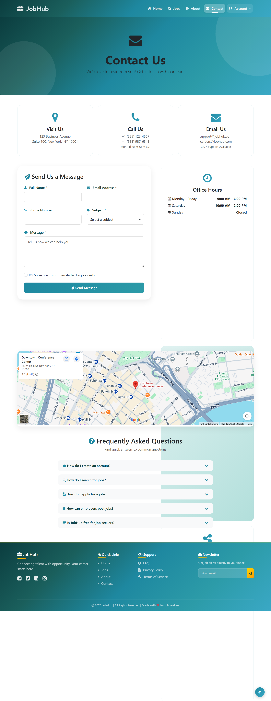
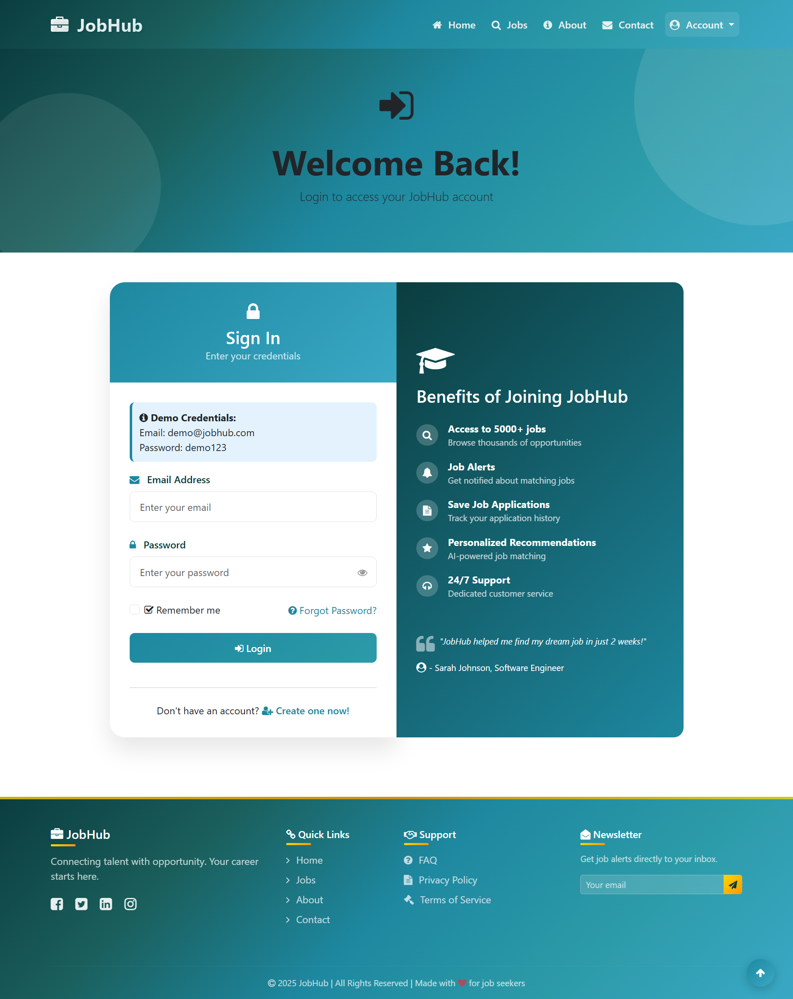
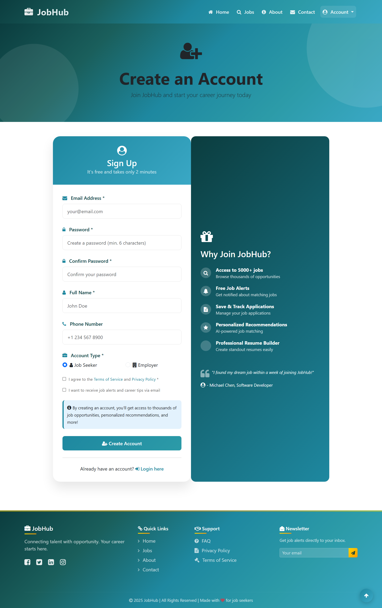
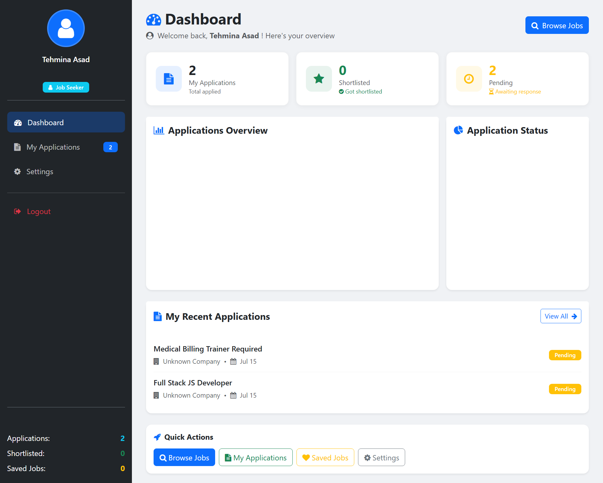
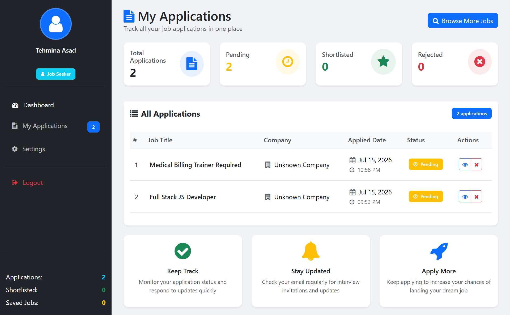

# 🚀 JobHub – Full Stack Job Portal Application

<p align="center">


</p>
# 🎯 Problem Statement

Recruitment is often a time-consuming and inefficient process for both employers and job seekers. Companies struggle to manage job postings, organize applications, and track candidates through different hiring stages. On the other hand, job seekers frequently face difficulties finding relevant opportunities and monitoring the status of their applications.

Traditional recruitment methods involve manual communication, scattered records, and limited visibility into the hiring process, leading to delays, poor user experience, and reduced productivity.

---

# 💡 Solution

**JobHub** is designed to simplify the entire recruitment workflow by providing a centralized platform where employers and job seekers can interact efficiently.

The platform offers role-based dashboards, secure authentication, application management, recruitment analytics, and real-time application tracking, creating a seamless hiring experience from job posting to final hiring decisions.

---

# ✨ Features

## 👨‍💼 Employer Features

| Feature | Description |
|---------|-------------|
| 📝 Job Management | Create, edit, update and delete job postings |
| 👥 Applicant Management | View all applicants for every posted job |
| 📊 Dashboard Analytics | Monitor applications and recruitment statistics |
| ⭐ Candidate Shortlisting | Shortlist suitable candidates |
| 🔄 Status Management | Update application status (Pending, Reviewed, Shortlisted, Rejected, Hired) |
| 📄 Job Details | View complete job information and applicants |
| 🔒 Secure Authentication | Session-based secure login |
| 👤 Profile Management | Update company profile and account settings |
| 🔑 Password Management | Change password securely |
| 📈 Recruitment Insights | Track hiring activities through analytics |

---

## 👨‍🎓 Job Seeker Features

| Feature | Description |
|---------|-------------|
| 🔍 Browse Jobs | Explore available job opportunities |
| 🎯 Smart Search | Search jobs by title, category, location, and type |
| 📄 Online Applications | Apply directly through the platform |
| 📊 Application Tracking | Track every application status in real time |
| ❌ Withdraw Applications | Withdraw pending applications |
| ❤️ Save Jobs | Bookmark jobs for later |
| 👤 Profile Management | Update profile information |
| 🔑 Password Management | Secure password updates |
| 📱 Responsive Dashboard | Access the platform from any device |

---

## 🌍 General Features

- 🔐 Role-Based Authentication
- 🔒 Session Management
- 📱 Fully Responsive UI
- 🎨 Clean Bootstrap Interface
- 📊 Interactive Dashboard Charts
- 🔔 Toast Notifications
- ⚡ Fast Server-Side Rendering (EJS)
- 🛡️ Secure Password Hashing
- 📈 Analytics Dashboard
- 📑 REST API Architecture
- 📂 Organized Project Structure
- 💻 Clean & Maintainable Codebase

---

# 🛠️ Technology Stack

## Backend

| Technology | Purpose |
|------------|----------|
| Node.js | JavaScript Runtime |
| Express.js | Backend Framework |
| MongoDB | NoSQL Database |
| Mongoose | ODM for MongoDB |
| Express Session | Session Management |
| bcrypt | Password Hashing |
| dotenv | Environment Variables |

---

## Frontend

| Technology | Purpose |
|------------|----------|
| EJS | Server Side Rendering |
| Bootstrap 5 | Responsive UI Framework |
| HTML5 | Markup |
| CSS3 | Styling |
| JavaScript (ES6) | Client-side Functionality |
| Font Awesome | Icons |
| Chart.js | Dashboard Analytics |

---

## Development Tools

| Tool | Purpose |
|------|----------|
| Git | Version Control |
| GitHub | Repository Hosting |
| VS Code | Development Environment |
| MongoDB Compass | Database Management |
| Postman | API Testing |
| Nodemon | Development Server |

---

# 📊 Project Statistics

| Metric | Value |
|---------|------|
| User Roles | 2 |
| Database Collections | 3 |
| API Endpoints | 20+ |
| Dashboard Modules | 2 |
| Project Pages | 25+ |
| Job Types | 6 |
| Application Statuses | 5 |
| Authentication System | Session Based |
| Responsive Design | ✅ |
| REST APIs | ✅ |
| Open Source | ✅ |

---

## 🌟 About The Project

**JobHub** is a modern, full-stack Job Portal application designed to connect **Employers** with **Job Seekers** through a secure and user-friendly platform.

The application provides a complete recruitment workflow where employers can publish job opportunities, manage applicants, shortlist candidates, and update hiring statuses, while job seekers can explore opportunities, apply online, and track their application progress in real time.

Built using **Node.js**, **Express.js**, **MongoDB**, **EJS**, and **Bootstrap**, the project demonstrates real-world backend architecture, authentication, database management, REST APIs, session handling, dashboard analytics, and role-based authorization.

This project was developed as a portfolio project to demonstrate production-level Full Stack Web Development skills.

---

## ✨ Highlights

- 💼 Complete Recruitment Platform
- 🔐 Secure Authentication System
- 👨‍💼 Employer Dashboard
- 👨‍🎓 Job Seeker Dashboard
- 📄 Online Job Applications
- 📊 Dashboard Analytics
- 📱 Fully Responsive Design
- 🔍 Advanced Job Search
- ⚡ REST API Support
- 📈 Application Tracking System
- 🏗️ Production Ready Architecture

---

# 📑 Table of Contents

- [Project Overview](#-about-the-project)
- [Problem Statement](#-problem-statement)
- [Solution](#-solution)
- [Features](#-features)
- [Technology Stack](#-technology-stack)
- [Project Structure](#-project-structure)
- [Database Design](#-database-design)
- [REST API](#-rest-api)
- [Installation](#-installation)
- [Environment Variables](#-environment-variables)
- [Application Flow](#-application-flow)
- [Screenshots](#-screenshots)
- [Security Features](#-security-features)
- [Performance Optimizations](#-performance-optimizations)
- [Deployment](#-deployment)
- [Future Improvements](#-future-improvements)
- [Contributing](#-contributing)
- [License](#-license)
- [Author](#-author)


## 🎯 Why This Project?

Finding the right job and managing the recruitment process efficiently remains a challenge for both employers and job seekers.

Many existing solutions are either too complex, expensive, or lack essential features such as applicant tracking, role-based dashboards, and recruitment analytics.

**JobHub** solves these problems by providing a centralized platform where companies can hire efficiently while candidates can easily discover and apply for opportunities.
# 🏗️ System Architecture

```text
                        ┌──────────────────────────┐
                        │        Web Browser       │
                        │ (Desktop / Mobile User)  │
                        └─────────────┬────────────┘
                                      │
                                      ▼
                        ┌──────────────────────────┐
                        │      Express Server      │
                        │      Node.js Runtime     │
                        └─────────────┬────────────┘
                                      │
             ┌────────────────────────┼────────────────────────┐
             ▼                        ▼                        ▼
      Authentication             Job Module            Application Module
      Session Control          CRUD Operations          Apply / Track Jobs
             │                        │                        │
             └────────────────────────┼────────────────────────┘
                                      ▼
                           ┌─────────────────────┐
                           │      MongoDB        │
                           │ Users • Jobs • Apps │
                           └─────────────────────┘
```

---

# 📂 Project Structure

```text
JobHub
│
├── middleware/
│   └── auth.js
│
├── public/
│   ├── css/
│   ├── js/
│   ├── images/
│   └── uploads/
│
├── views/
│   ├── afterlogin/
│   ├── includes/
│   ├── layouts/
│   ├── partials/
│   ├── index.ejs
│   ├── login.ejs
│   ├── register.ejs
│   ├── jobs.ejs
│   └── ...
│
├── package.json
├── package-lock.json
├── .gitignore
├── README.md
└── index.js
```

---

# 🗄️ Database Design

The application is powered by **MongoDB**, using a document-based database structure that allows flexibility, scalability, and high performance.

---

## 👤 Users Collection

Stores information for both **Employers** and **Job Seekers**.

### Main Fields

- Full Name
- Email
- Password (Encrypted)
- Phone Number
- Role
- Company
- Bio
- Website
- Location
- Session Token
- Created Date
- Updated Date

---

## 💼 Jobs Collection

Stores all published job opportunities.

### Main Fields

- Job Title
- Company
- Description
- Required Skills
- Salary
- Location
- Experience
- Employment Type
- Vacancies
- Status
- Applications Count
- Views
- Created Date

---

## 📄 Applications Collection

Stores every submitted application.

### Main Fields

- Applicant Information
- Job Information
- Cover Letter
- Skills
- Education
- Experience
- Status
- Applied Date
- Updated Date


# 🔄 Application Workflow

```text
Register
    │
    ▼
Login
    │
    ▼
Dashboard
    │
 ┌──┴─────────────┐
 │                │
 ▼                ▼
Employer      Job Seeker
 │                │
 ▼                ▼
Create Job    Browse Jobs
 │                │
 ▼                ▼
Receive Apps  Apply Job
 │                │
 ▼                ▼
Review Apps   Track Status
 │                │
 ▼                ▼
Hire / Reject  View Updates
```


# 🔐 Authentication Flow

```text
User
 │
 ▼
Register
 │
 ▼
Password Hashing (bcrypt)
 │
 ▼
MongoDB
 │
 ▼
Login
 │
 ▼
Session Created
 │
 ▼
Role Verification
 │
 ▼
Dashboard Access
```


# 📊 Project Modules

| Module | Description |
|---------|-------------|
| Authentication | User Registration & Login |
| Employer Dashboard | Manage Jobs & Applicants |
| Job Seeker Dashboard | Browse & Apply Jobs |
| Job Management | Create, Update & Delete Jobs |
| Application Module | Apply & Track Applications |
| Analytics | Charts & Statistics |
| Settings | Profile & Password Management |
| Public Pages | Home, About, Contact, FAQ |


# 💻 Software Engineering Concepts

This project demonstrates several real-world software engineering concepts including:

- MVC-inspired project organization
- Session-based Authentication
- CRUD Operations
- RESTful API Design
- Role-Based Authorization
- Form Validation
- Database Relationships
- Modular Development
- Responsive User Interface
- Clean Code Principles
- Scalable Folder Structure
- Secure User Authentication
# ⚙️ Installation Guide

Follow the steps below to run the project locally.

---

## 📋 Prerequisites

Before getting started, make sure you have installed:

- Node.js (v18 or later)
- MongoDB (Local or Atlas)
- Git
- VS Code (Recommended)

You can verify the installation using:

```bash
node -v
npm -v
git --version
```

---

# 📥 Clone Repository

```bash
git clone https://github.com/YOUR_GITHUB_USERNAME/jobhub.git
```

```bash
cd jobhub
```

---

# 📦 Install Dependencies

Install all required packages.

```bash
npm install
```

---

# 🔑 Environment Variables

Create a **.env** file in the project root.

```env
PORT=3000

MONGODB_URI=mongodb://127.0.0.1:27017/jobhub

SESSION_SECRET=your_super_secret_key

NODE_ENV=development
```

> ⚠️ Never commit your `.env` file to GitHub.

---

# ▶️ Running the Project

### Development Mode

```bash
nodemon
```

---

# 🌐 Application URLs

Once the server is running:

| Service | URL |
|---------|------|
| Home Page | http://localhost:3000 |
| Login | http://localhost:3000/login |
| Register | http://localhost:3000/register |
| Jobs | http://localhost:3000/jobs |
| Dashboard | http://localhost:3000/dashboard |

---

# 📡 REST API Overview

The application follows RESTful API principles.

## Public Endpoints

| Method | Endpoint | Description |
|---------|----------|-------------|
| GET | /jobs | Get all jobs |
| GET | /jobs/:id | Get single job |
| POST | /register | Register user |
| POST | /login | Login user |

---

## Protected Endpoints

| Method | Endpoint | Description |
|---------|----------|-------------|
| GET | /dashboard | User Dashboard |
| GET | /applications | User Applications |
| POST | /apply | Apply for Job |
| PUT | /profile | Update Profile |
| PUT | /password | Change Password |

---

## Employer Endpoints

| Method | Endpoint | Description |
|---------|----------|-------------|
| GET | /my-jobs | View Posted Jobs |
| POST | /create-job | Create New Job |
| PUT | /job/:id | Update Job |
| DELETE | /job/:id | Delete Job |
| GET | /job/:id/applicants | View Applicants |
| PUT | /application/:id/status | Update Applicant Status |

---

# 📨 Sample API Response

```json
{
  "success": true,
  "message": "Job created successfully.",
  "data": {
    "_id": "665ac9a18d93ab2f5ef91a10",
    "title": "Full Stack Developer",
    "company": "JobHub Technologies",
    "location": "Lahore, Pakistan",
    "type": "Full-Time"
  }
}
```

---

# 🔒 Authentication

The application uses **Session-Based Authentication**.

Authentication flow:

```
User Login
      │
      ▼
Password Verification
      │
      ▼
Session Created
      │
      ▼
Cookie Stored
      │
      ▼
Protected Routes
```

---

# ✅ Validation

The application includes validation on both the client and server sides.

### Client Side

- Required Fields
- Email Format
- Password Length
- Confirm Password
- Empty Input Validation

### Server Side

- Duplicate Email Check
- Session Validation
- User Authorization
- Data Sanitization
- Input Validation

---

# 🚨 Error Handling

The project handles common errors gracefully.

- Invalid Login Credentials
- Unauthorized Access
- Invalid Request
- Database Errors
- Page Not Found (404)
- Internal Server Error (500)


# 🧪 Testing Checklist

Before deployment, verify the following:

- ✅ User Registration
- ✅ User Login
- ✅ Job Creation
- ✅ Job Update
- ✅ Job Application
- ✅ Application Tracking
- ✅ Dashboard Statistics
- ✅ Logout
- ✅ Session Expiry
- ✅ Responsive Layout
# 🔒 Security Features

Security was considered throughout the development process to ensure a safe and reliable user experience.

### Authentication & Authorization

- Session-Based Authentication
- Role-Based Access Control
- Protected Routes
- Secure Login & Registration
- Logout Session Management

### Password Security

- Password Hashing using bcrypt
- Encrypted Password Storage
- Secure Password Update

### Input Validation

- Client-side Validation
- Server-side Validation
- Required Field Validation
- Email Format Validation
- Duplicate Email Prevention

### Secure Coding Practices

- Session Protection
- Authentication Middleware
- Input Sanitization
- Error Handling
- Secure Database Queries

---

# ⚡ Performance Optimizations

The project includes several optimizations for better performance and scalability.

- Fast Server-Side Rendering (EJS)
- Optimized MongoDB Queries
- Clean Folder Structure
- Reusable Components
- Efficient Session Management
- Responsive Bootstrap Layout
- Lightweight Frontend Assets
- Organized Codebase
- Modular Development Approach

---

# 🚀 Deployment

The application is developed with a deployment-ready architecture and can be hosted on multiple cloud platforms.

### Supported Platforms

- Render
- Railway
- DigitalOcean
- VPS (Ubuntu)
- AWS EC2
- Microsoft Azure

> Deployment instructions will be added in future releases.

---

# 📸 Screenshots

The following screenshots will be added soon.

- 🏠 Home Page
- 🔐 Login Page
- 📝 Register Page
- 💼 Browse Jobs
- 📄 Job Details
- 👨‍💼 Employer Dashboard
- 👨‍🎓 Job Seeker Dashboard
- 📊 Analytics Dashboard
- ⚙️ Settings Page

---
# 📸 Screenshots

## 🏠 Home Page


## 🏠 About Page


## 🏠 Contact Page

---
## 🔐 Login Page



---
## 📝 Register Page



## 📝 Dashboard


## 📝 Create New Job


## 📝 My Jobs


## 📝 settings


## 📝 showjobs


## 📝 Applications For Seeker



# 🛣️ Future Improvements

The following features are planned for future releases.

- Resume / CV Upload
- Email Notifications
- Google Authentication
- Company Profiles
- Saved Jobs
- Advanced Search Filters
- Real-Time Notifications
- Chat Between Employer & Candidate
- Admin Dashboard
- Mobile Application
- AI-Based Job Recommendations
- Interview Scheduling
- Resume Parsing
- Multi-language Support

---

# 🤝 Contributing

Contributions are welcome!

If you have ideas for improvements, feel free to:

1. Fork the repository
2. Create a new feature branch
3. Commit your changes
4. Push to your branch
5. Open a Pull Request

Every contribution is highly appreciated.

---

# 📄 License

This project is licensed under the **MIT License**.

You are free to use, modify, and distribute this project under the terms of the license.

See the `LICENSE` file for more information.

---

# 👨‍💻 Author

## Muhammad Asad

**Full Stack Web & Mobile Application Developer**

Specializing in:

- Laravel
- React.js
- Node.js
- Express.js
- MongoDB
- MySQL
- PHP
- JavaScript

---

### 🌐 Connect With Me

- 💼 LinkedIn: *https://www.linkedin.com/in/muhammadasad0/*
- 💻 GitHub: *https://github.com/asadmukhtarr*
- 🌍 Portfolio: **https://asadmukhtar.online**
- 📧 Email: *contact@asadmukhtar.online*

---

# ⭐ Support

If you found this project useful, consider giving it a ⭐ on GitHub.

It helps the project reach more developers and motivates future improvements.

---

# 🙏 Acknowledgements

Special thanks to the open-source community and the creators of:

- Node.js
- Express.js
- MongoDB
- Bootstrap
- EJS
- Font Awesome
- Chart.js

Their amazing tools made this project possible.

---

<p align="center">

### ⭐ Don't forget to Star this Repository ⭐

Made with ❤️ by **Muhammad Asad**

</p>

